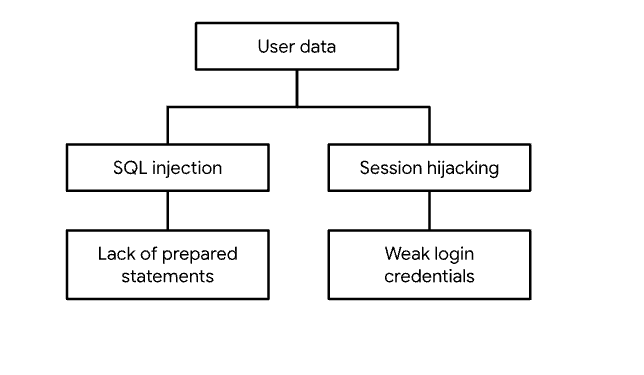

### Example PASTA

| Stages | Sneaker Company |
|--------|-----------------|
| I. Define business and security objectives |  - Users can create member profiles internally or by connecting external accounts. The app must process financial transactions.The app should be in compliance with PCI-DSS. |
| II. Define the technical scope | Technologies Used: - Application programming interface (API),Public key infrastructure (PKI), SHA-256, SQL Technical Considerations:  APIs facilitate the exchange of data between customers, partners, and employees, so they should be prioritized. They handle a lot of sensitive data while they connect various users and systems together. However, details such as which APIs are being used should be considered before prioritizing one technology over another. So, they can be more prone to security vulnerabilities because there’s a larger attack surface. |
| III. Decompose application | Sample Data Flow Diagram:  | 
| IV. Threat analysis | Types of Threats: - Injection,Session hijacking |
| V. Vulnerability analysis | Vulnerabilities: - Lack of prepared statements,Broken API token |
| VI. Attack modeling |  Sample Attack Tree Diagram:
 |
| VII. Risk analysis and impact | Security Controls: - SHA-256, Incident response procedures, Password policy, Principle of least privilege |
